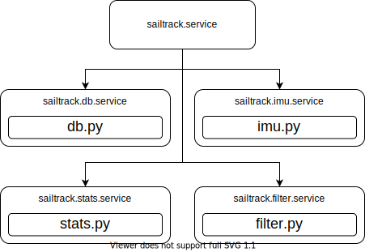

# SailTrack Core
Central module of the SailTrack system, it manages connections and gathers data.

## Hardware Architecture

  

## Software Architecture

  

## Resources
* [Bill Of Materials](BOM.csv)
* [Code Repository](https://github.com/metis-vela-unipd/sailtrack-core)
