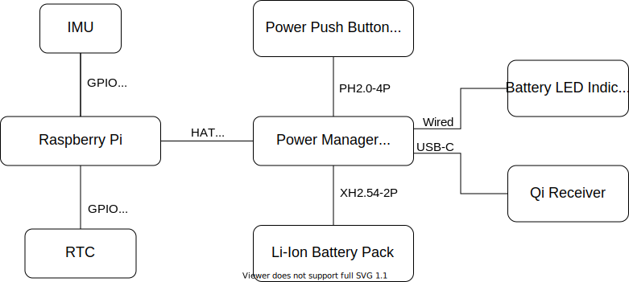

# SailTrack Core
Central module of the SailTrack system, it manages connections and gathers data. This module is based on a Raspberry Pi, running the latest version of Raspberry Pi OS. This module contains also the IMU sensor.

## Hardware Architecture
<p align="center">
  
</p>

## Software Architecture [DRAFT]
The software is structured in services and tasks. Each task is represented by a Python script that runs in a standalone process, and each service is a unit service managed by `systemd`. All the services are grouped under a single, unique, root service.
```
.
└── sailtrack.service
    ├── sailtrack.db.service
    │   └── db.py
    ├── sailtrack.imu.service
    │   └── imu.py
    ├── sailtrack.filter.service
    │   └── filter.py
    └── sailtrack.lora.service
        └── lora.py
```

## Resources
* [Bill Of Materials](BOM.csv)
* [Code Repository](https://github.com/metis-vela-unipd/sailtrack-core)
