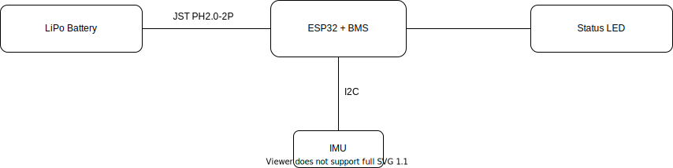

# SailTrack IMU
Module for getting combined orientation and acceleration data of the boat.

## Hardware Architecture

  

## Resources
* [Bill Of Materials](BOM.csv)
* [Code Repository](https://github.com/metis-vela-unipd/sailtrack-imu)
* [3D Printed Enclosure](STL)
