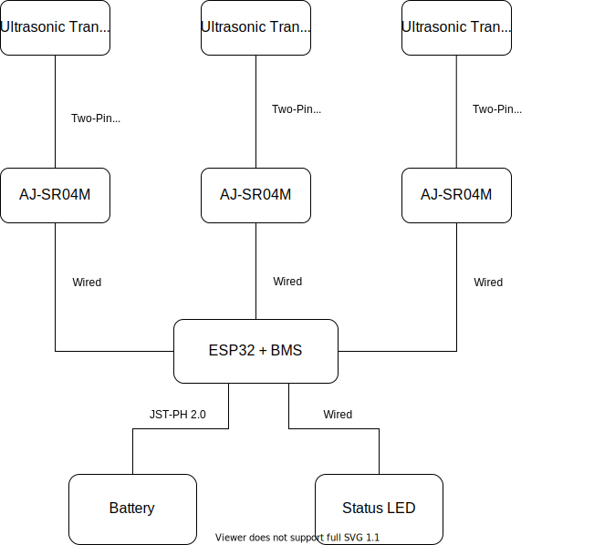

# SailTrack Wind
Module for getting wind data, such as direction and intensity, based on inexpensive ultrasonic tranducers intended for distance measurements.

  

### Resources
* [Bill Of Materials](BOM.csv)
