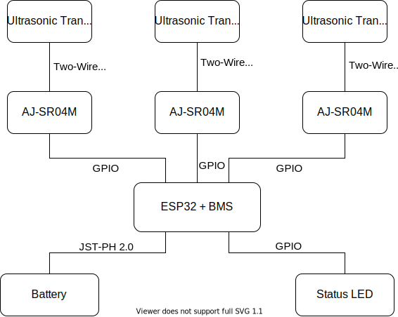

# SailTrack Wind
Module for getting wind data, such as direction and intensity, based on inexpensive ultrasonic tranducers intended for distance measurements.

## Hardware Architecture

  

## Resources
* [Bill Of Materials](BOM.csv)
* [Code Repository](https://github.com/metis-vela-unipd/sailtrack-wind)
